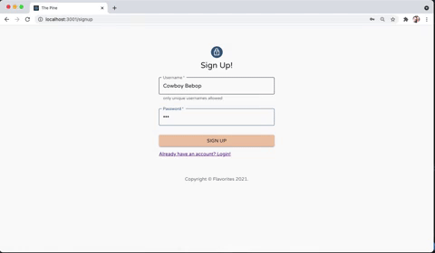
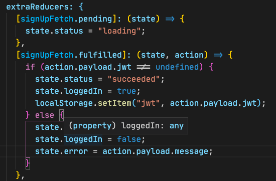
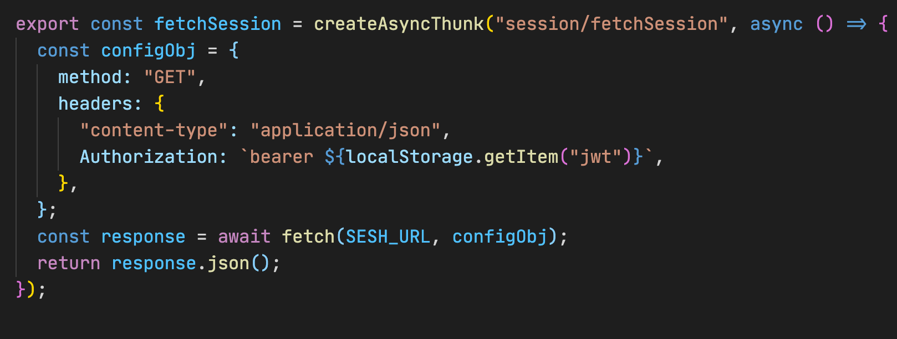
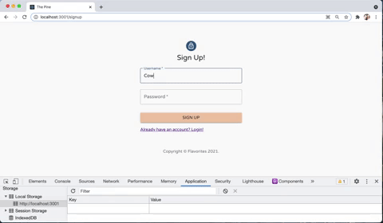
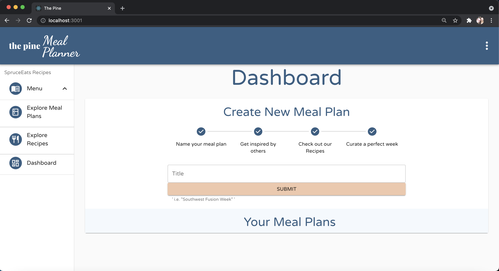
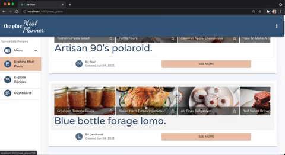

# Flavorites, the Pine Meal Planner

### Table of Contents
1. [Purpose](#purpose)
2. [Demo](#demo)
3. [Features](#features)
   1. [Sign-In](#sign-in)
        1. [Authentification](#auth)
   1. [Dashboard](#dashboard)
         1. [Meal Plan Excerpt](#mp-card)
         1. [Drag and Drop Editor](#dnd)
   1. [Recipes](#recipes)
        1. [Dynamic Database Search](#ddbs)
        1. [Recipe Show Page](#recipe)
   1. [Meal Plans](#meal-plans)
4. [Flavorite Sections of Code](#flavorites)

## Purpose 
This is an online web application as a feature to an existing recipe website. Its purpose is to engage and give the users an additional tool in using the recipe data and mantain a community around the existing site. Making food interesting, unique and fun is hard. With a tool to help plan your meals can help reduce stress and create a great community. 

## Demo 
link to demo video

## Features 
Transcript for the demonstration. We will go through  each features of the application as a user and how I accomplish these through code. 

### Sign-up & Login  

Sign up for the application is managed mostly on the backend. With user validations / Bcrypt / and JWT tokens. Front end validations are mostly form validation i.e password, char length etc. 

The validations and db constraints will send a message back if they are activated. Those messages will be rendered as helper text on the text area. 

On the front end I have a slice of my Redux store dedicated purely to my sessions. This will control a global loggedIn status that is dependent on a JWT token being in local storage.

 Honestly it could look like a JWT token to make it pass the private routing but the content is validated on the backend with each fetch and no private content will render without authorization. 

### Authentification 

>The jwt is kept in the Auth headers and validated on the backend 

When logging in the actions are: storing the jwt in local storage, iniate a counter in local storage and initiate a brief history in sessions so if there is a refresh my program will know where it is at and what content to render. This is using React Router useLocation hook, striped to pathname and then I can render based on conditionals. This will be shown later. 

>It was a purposeful design decision to name this slice 'sessions' as it is the title of my controller on my backend. I follow the DUCK directory design used in Redux Toolkit but name the files in the feature folders to follow along with the rails naming convention for views that mimic controller actions. i.e. index/show/edit etc. This is a field of interest for me improving and expanding upon. [^1]

The intial state of my sessions slice
### Dashboard  
When you are authorized login or sign-up you are taken to the user dashboard, quiet tasteful if I might say. As a new user you do not have any meal plans but you do have a set of instructions that guide the new user on how to make new meal plans. This can be increased with additional pointers and guides.

>I do enjoy the minimalist timeline feel though. 

As you follow the instructions you can create a new meal plan. 

 The meal plan is instanciated empty of course and the user is prompted to find inspiration through recipes and other user's meal plans. So let's go see other user's plans. 

### Meal Plans  

The initial page for exploring meal plans will hold all of the user's meal plans. Paginating this and creating keyword searches could be easily implemented and are already features for the individual recipe search. 

The meals have a horizontal scroll bar on the excerpt display card. 

You can see how I impolemented that here: 
[Horizontal Scroll](src/features/plans/PlanExcerpt.js)

This is not the best user experience as the scroll pad can easily make the browser go back and it is not a natural feel.

This was a design decision based on variety. I wanted to display a different excerpt card than the one on the dashboard that we will see later. 

We can use the button on the cared to follow it to the meal plan recipe display page, where you can see previews for each recipe that belongs to the meal plan. 

**Additional features** would include being able to 'flavorite' a meal plan as a reference to a meal plan you really enjoy. 

**Before we more on** Let us take a look on how we are going to be navigating in the application. 
## Navigation and Routes

### Meal Plan Edit 

### Recipes  
### Dynamic Database Search 

[^1]: Redux Toolkit and Rails as an API. DUCK directory design and using the files as Rail views has peaked my interest. 