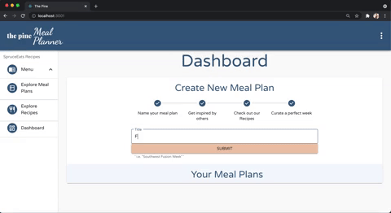
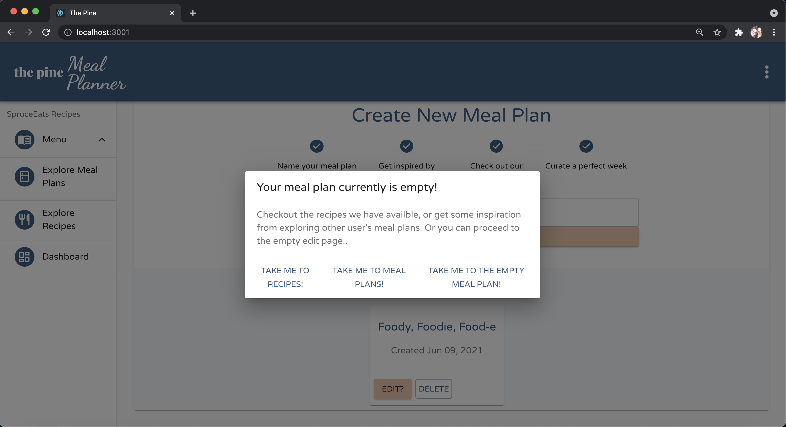
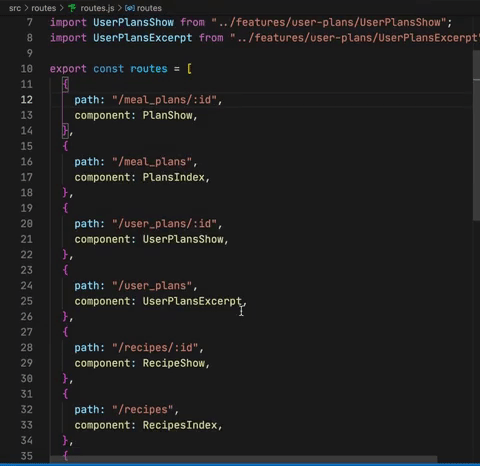
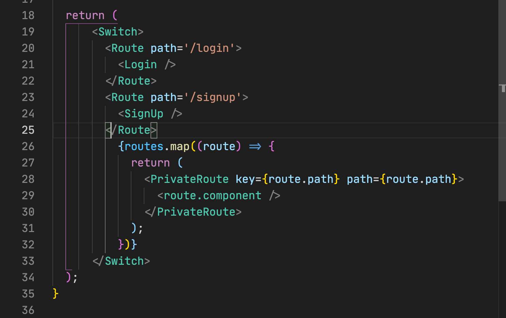
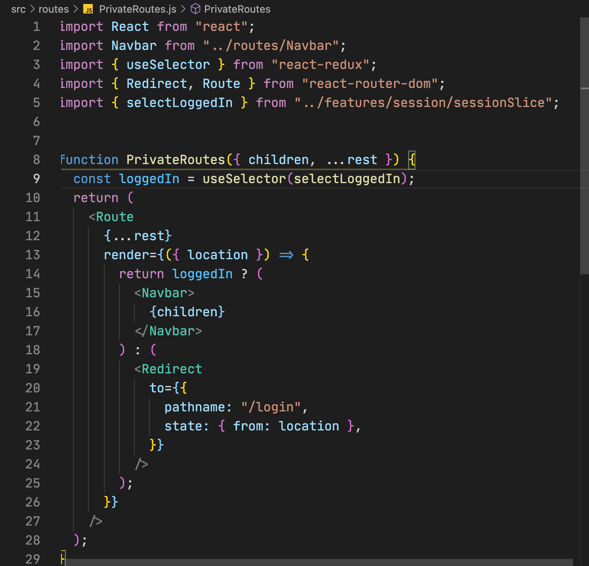
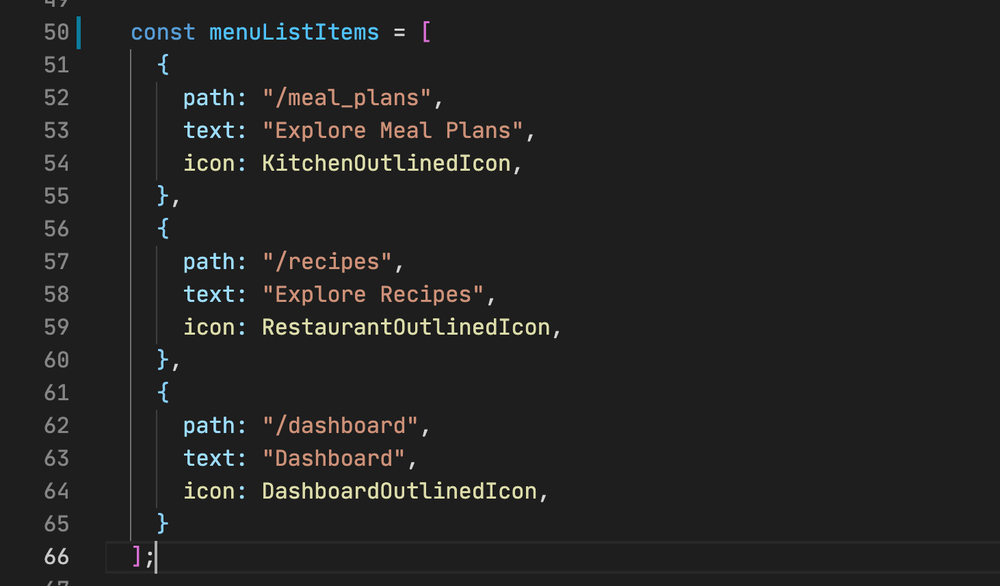
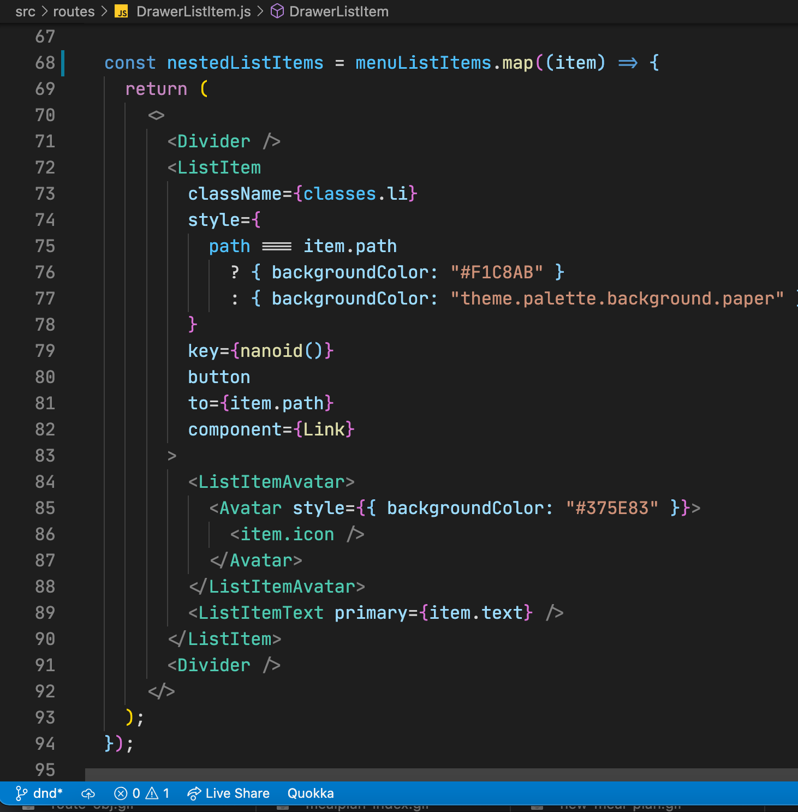
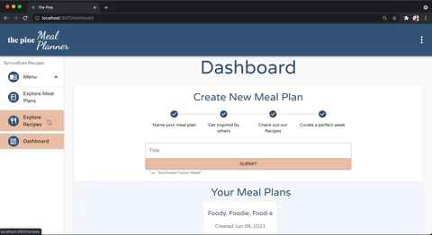
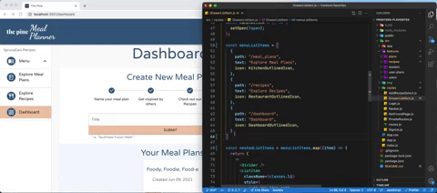
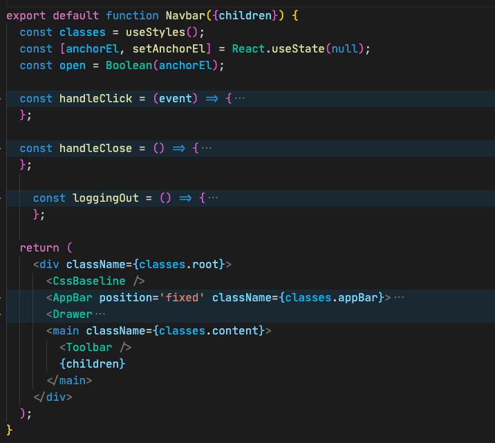

# Flavorites, the Pine Meal Planner

Thank you for spending the time on checking out this project. It really is a labor of love, and if you have any code review or notes I would enjoy talking about them or design decisions. Please reach me through my account information on my GitHub profile. 

## Accessability
I am using gifs and images in this walkthrough. If you or the screen reader can not interepret I will place links to the direct code that I am referencing under each image. Note on the GIFs, everything I go over here is covered in the demo video. The subtitles of the demo video are provided by Youtube. 

### Table of Contents
1. [Purpose](#purpose)
2. [Demo](#demo)
3. [Features](#features)
   1. [Sign-In](#sign-in)
        1. [Authentification](#auth)
   1. [Dashboard](#dashboard)
         1. [Meal Plan Excerpt](#mp-card)
         1. [Drag and Drop Editor](#dnd)
   1. [Recipes](#recipes)
        1. [Dynamic Database Search](#ddbs)
        1. [Recipe Show Page](#recipe)
   1. [Meal Plans](#meal-plans)
4. [Flavorite Sections of Code](#flavorites)


## Purpose <a name="purpose"></a>
This is an online web application as a feature to an existing recipe website. Its purpose is to engage and give the users an additional tool in using the recipe data and mantain a community around the existing site. Making food interesting, unique and fun is hard. With a tool to help plan your meals can help reduce stress and create a great community. 

## Demo <a name="demo"></a>
link to demo video

## Features <a name="features"></a>
Transcript for the demonstration. We will go through  each features of the application as a user and how I accomplish these through code. 

### Sign-up & Login  <a name="sign-in"></a>

Sign up for the application is managed mostly on the backend. With user validations / Bcrypt / and JWT tokens. Front end validations are mostly form validation i.e password, char length etc. 

The validations and db constraints will send a message back if they are activated. Those messages will be rendered as helper text on the text area. 


[Sign-Up Code](src/features/routes/SignUp.js)

On the front end I have a slice of my Redux store dedicated purely to my sessions. This will control a global loggedIn status that is dependent on a JWT token being in local storage.


[Login Code](src/features/routes/Login.js)

 Honestly it could look like a JWT token to make it pass the private routing but the content is validated on the backend with each fetch and no private content will render without authorization. 

### Authentification <a name="auth"></a>

>The jwt is kept in the Auth headers and validated on the backend 


[Session Fetch Code](src/features/session/sessionSlice.js)

When logging in the actions are: storing the jwt in local storage, iniate a counter in local storage and initiate a brief history in sessions so if there is a refresh my program will know where it is at and what content to render. This is using React Router useLocation hook, striped to pathname and then I can render based on conditionals. This will be shown later.[^1] [^2]


[Login Code](src/features/routes/Login.js)

>It was a purposeful design decision to name this slice 'sessions' as it is the title of my controller on my backend. I follow the DUCK directory design used in Redux Toolkit but name the files in the feature folders to follow along with the rails naming convention for views that mimic controller actions. i.e. index/show/edit etc. This is a field of interest for me improving and expanding upon. [^3]


[Session Fetch Code](src/features/session/sessionSlice.js) |
The intial state of my sessions slice

### Dashboard  <a name="dashboard"></a>
When you are authorized login or sign-up you are taken to the user dashboard, quiet tasteful if I might say. As a new user you do not have any meal plans but you do have a set of instructions that guide the new user on how to make new meal plans. This can be increased with additional pointers and guides.


[Dashboard Code](src/features/session/Dashboard.js)
>I do enjoy the minimalist timeline feel though. 


As you follow the instructions you can create a new meal plan. 


[Dashboard Code](src/features/session/Dashboard.js)

 The meal plan is instanciated empty of course and the user is prompted to find inspiration through recipes and other user's meal plans. So let's go see other user's plans. 



[Dashboard Code](src/features/session/Dashboard.js)
### Meal Plans  <a name="meal-plans"></a>

The initial page for exploring meal plans will hold all of the user's meal plans. Paginating this and creating keyword searches could be easily implemented and are already features for the individual recipe search. 


[Meal Plan Index](src/features/plans/PlansIndex.js)

The meals have a horizontal scroll bar on the excerpt display card. 

You can see how I impolemented that here: 
[Horizontal Scroll](src/features/plans/PlanExcerpt.js)

This is not the best user experience as the scroll pad can easily make the browser go back and it is not a natural feel.

This was a design decision based on variety. I wanted to display a different excerpt card than the one on the dashboard that we will see later. 

We can use the button on the cared to follow it to the meal plan recipe display page, where you can see previews for each recipe that belongs to the meal plan. 

**Additional features** would include being able to 'flavorite' a meal plan as a reference to a meal plan you really enjoy. 


**Before we more on** Let us take a look on how we are going to be navigating in the application. 
## Navigation and Routes
This section is split into two sections, the navigation in the application using the drawer buttons and how the routing is set up. 

### Routing 
I am using React Router v.5.2 which is the latest version and I take advantage of their great hooks. 

I leveraged React's power of composition to create private routes and public routes. 

I created a routes object that stores the component to be rendered and the route that triggers that render. 



[Routes](src/features/routes/routes.js)

This will allow me to create a private route by simply adding a component and route name to the object. I love React composition! 

This allows my app file to remain simple, rendering an easy to read router. 


[App Code](src/features/routes/app.js)

This is where the magic happens though. We use the private route as a component that composes routes for us. This also lends us the opprotunity to render all of our componenets as children of the navbar which means the page content will be in the correct spot with our permanent drawer and toolbar. 


[Private Route Code](src/features/routes/PrivateRoutes.js)
>Double composition with a conditional render. Doesn't get more React than that. 

### Navigation

I again leverage compositon to help create menu list items that are link components/icon buttons.



[Menu List Icon Code](src/features/routes/DrawListItem.js)

First we compose the object to hold all of the information that we want to be mapped over. This list holds the path, the text for the menu list item, and the icon that we want displayed. 


We map over the Material-Ui components and you can notice a couple things. A conditional background color rendering based on the location of the page. 

[^1]: This is set with the location we are storing in sessions. 



The background will reflect the active page. 



>With the power of composition I can easily add a button or a route by adding to the composing objects. This will work for the private routes or the drawer menu list items. 

Here is adding a functional drawer menu list item with a working route and css highlight in less than 10 seconds to highlight this power. 




As I mentioned earlier, everything is composed through a private route component and inside of that component it is wrapped in my Navbar. 


[Navbar Code](src/features/routes/Navbar.js)
``` javascript
{children}
```
is our application. 
### Meal Plan Edit <a name="auth"></a>


### Recipes  <a name="recipes"></a>
### Dynamic Database Search <a name="ddbs"></a>


[^3]: Redux Toolkit and Rails as an API. DUCK directory design and using the files as Rail views has peaked my interest. 